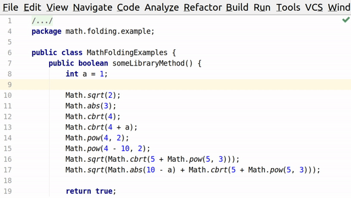

# Math Folding JetBrains Plugin

Intellij IDEA plugin to fold Math.abs, Math.pow, Math.sqrt, Math.cbrt into more readable, mathematical symbols.

# Examples:

`Math.sqrt(4)` → `√4`

`Math.pow(4 - 10, 3)` → `(4 - 10)³`

`Math.sqrt(Math.abs(10 - a) + Math.cbrt(5 + Math.pow(5, 3)))` →  `√(|10 - a| + ∛(5 + 5³))`

### Acknowledgements
Plugin icon made by [Freepik](https://www.flaticon.com/authors/freepik) from [Flaticon](https://www.flaticon.com)